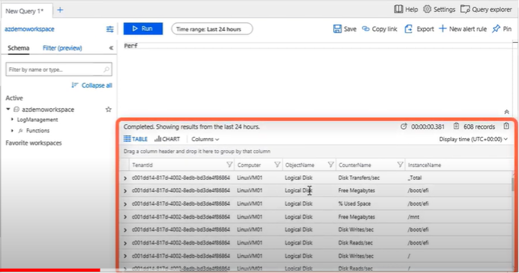
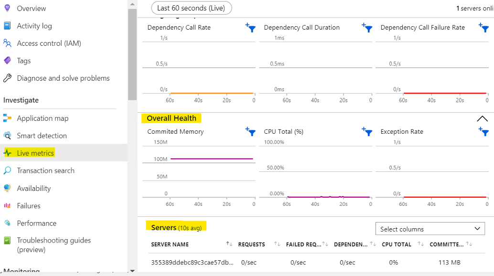

# End-to-End-Azure-Monitoring-URL-Tests-Logs-Alerts-Insights
This project demonstrates how to implement complete observability and monitoring for web applications using Azure. It covers URL availability tests, performance log monitoring, custom alert rules, and Application Insights integration for ASP.NET apps. Ideal for ensuring application health, diagnosing issues quickly, and automating alerting in production or staging environments.
## Table of Contents
- [Monitoring –Availability /URL ping test Troubleshooting](#url-ping-test-troubleshooting)
- [Log Monitoring for VM Ware and Windows Server](#monitoring-setup)
- [Sending resource Logs to Log Analytical Workspace](#log-analytics-integration)
- [Creating Alert Rules](#creating-alert-rules)
- [Application Insights Configuration](#application-insights-configuration)

## 🌐 Monitoring –Availability /URL ping test Troubleshootin 
Go to Application Insights > Availability →
Click + Add test →
Choose URL Ping Test.

Check for alerts →enabled

set for 

- URL to test  
- Test frequency (default: every 5 mins)  
- Locations (Azure regions)  
- Success criteria (response time, HTTP 200 OK, etc.)

- Example from My Experience:
While setting up a URL Ping Test in Azure Application Insights, I faced repeated DNS resolution failure errors, even though the site was accessible via browser.

🔍 Issue:
I had used monitorwebapp.net instead of the correct www.monitorwebapp.net, and DNS records were not properly configured.

🔧 Fix:
Updated the URL to https://www.monitorwebapp.net, verified DNS using nslookup, and ensured it pointed to the Azure App Service. The test passed after correction.

## 📘 Log Monitoring for VM ware in Azure and Windows Server
-  Objective:
To collect, analyze, and visualize logs from both VMware-based virtual machines and Windows Servers in Azure using Log Analytics.

✅ Setup Steps:
Install Azure Monitor Agent or Log Analytics Agent on the Windows Server.

Connect the data source(VM) to a Log Analytics Workspace.

Enable data collection rules for:
Event logs (e.g., Application, System, Security)

Adding Performance counters (e.g., CPU, RAM, Disk)

Used the following KQL query to collect performance data from the server: **type=perf**

🔍 Benefits:
- Centralized logging across hybrid environments

- Consistent security monitoring and compliance

## 🚨 Custom Alert Rule with KQL – CPU Utilization
As part of performance monitoring, I created a custom KQL-based alert rule in Azure Log Analytics to detect high CPU usage on servers and generate a meaningful alert message.

Objective:
To monitor all servers and send alerts if CPU usage exceeds 80% over the last 10 minutes.

KQL Query Used:

let CounterValue1 = 80;
let tmp = Perf
| where TimeGenerated > ago(10m)
| where CounterName == "% Processor Time" and ObjectName == "Processor"
| where InstanceName == "_Total"
| where CounterValue > CounterValue1
| distinct Computer;
tmp
| project Alert = strcat('This - ', Computer, ' CPU utilization level has reached greater than ', CounterValue1, '%' )

🛠️ What I Did:

- Created a Log Analytics alert rule using the above query.
- Targeted all machines reporting to the workspace.
- Ensured alert reliability by testing under controlled high-load conditions.

## 📦 Configuring Application Insights for ASP.NET
✅  What I Configured:

Installed SDK in my ASP.NET project.

Connected telemetry using the Azure resource’s Instrumentation Key.

Verified telemetry flow in Azure → Application Insights > Live Metrics.

Added custom event tracking for request failures and key application events.

🔍 Benefits of Using Application Insights with ASP.NET
- End-to-End Monitoring
Automatically tracks requests, dependencies, exceptions, and performance metrics without much manual effort.

- Real-Time Insights
Live Metrics Stream lets you see telemetry data (requests, failures, server responses) in real-time during deployments or incidents.

Smart Monitoring! 🎯

