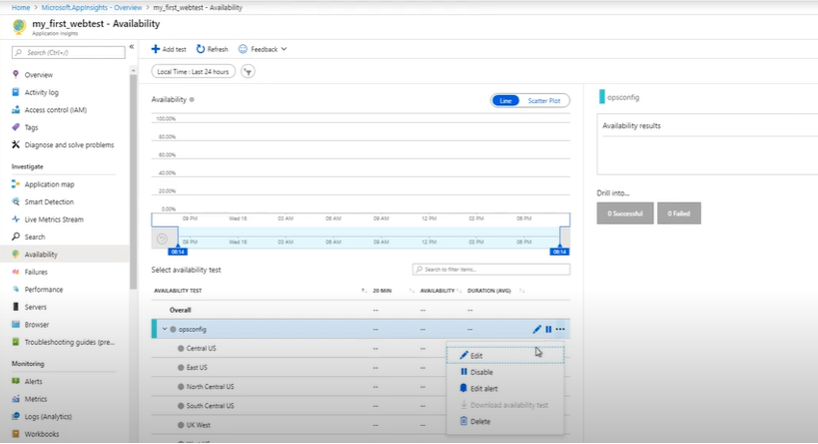

# End-to-End-Azure-Monitoring-URL-Tests-Logs-Alerts-Insights
## Table of Contents
- [Monitoring –Availability /URL ping test Troubleshooting](#url-ping-test-troubleshooting)
- [Log Monitoring for VM Ware and Windows Server](#monitoring-setup)
- [Sending resource Logs to Log Analytical Workspace](#log-analytics-integration)
- [Creating Alert Rules](#creating-alert-rules)
- [Application Insights Configuration](#application-insights-configuration)

## 🌐 Monitoring –Availability /URL ping test Troubleshootin 
Go to Application Insights > Availability -->
Click + Add test-->
Choose URL Ping Test.

Check for alerts -->enabled

set for 

- URL to test  
- Test frequency (default: every 5 mins)  
- Locations (Azure regions)  
- Success criteria (response time, HTTP 200 OK, etc.)

- Example from My Experience:
While setting up a URL Ping Test in Azure Application Insights, I faced repeated DNS resolution failure errors, even though the site was accessible via browser.

🔍 Issue:
I had used monitorwebapp.net instead of the correct www.monitorwebapp.net, and DNS records were not properly configured.

🔧 Fix:
Updated the URL to https://www.monitorwebapp.net, verified DNS using nslookup, and ensured it pointed to the Azure App Service. The test passed after correction.

## 📘 Log Monitoring for VM ware in Azure and Windows Server
-  Objective:
To collect, analyze, and visualize logs from both VMware-based virtual machines and Windows Servers in Azure using Log Analytics.

✅ Setup Steps:
Install Azure Monitor Agent or Log Analytics Agent on the Windows Server.

Connect the data source(VM) to a Log Analytics Workspace.

Enable data collection rules for:
Event logs (e.g., Application, System, Security)

Adding Performance counters (e.g., CPU, RAM, Disk)

Query KQL to collect the server data 

